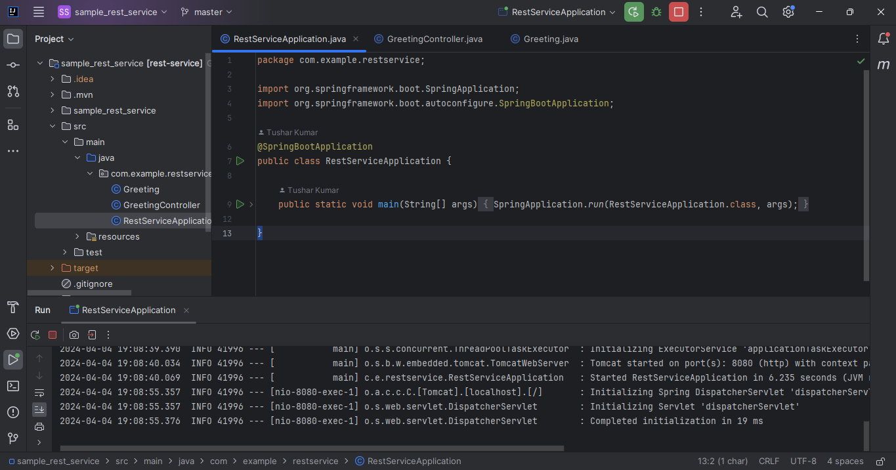
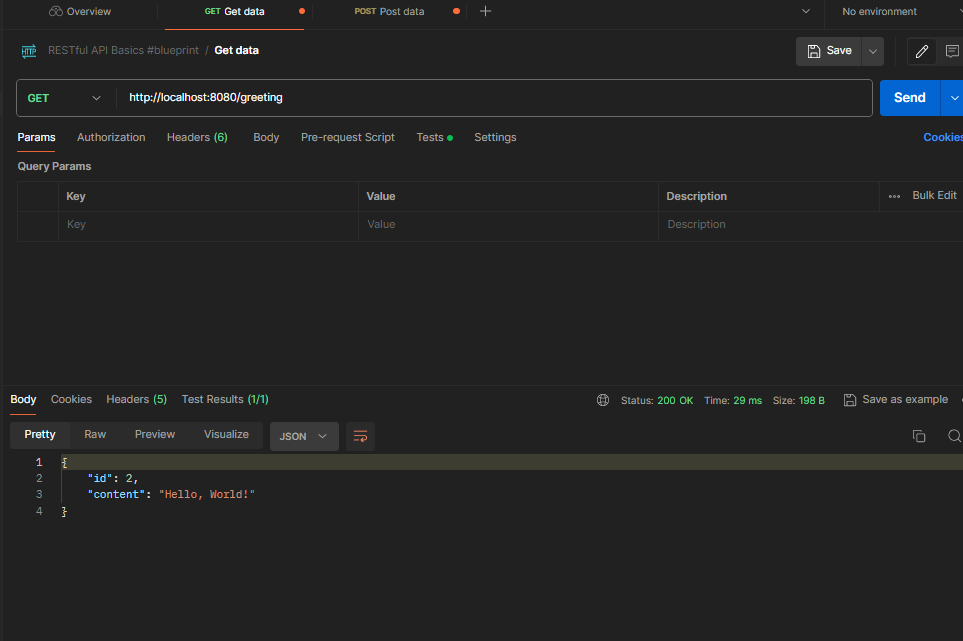
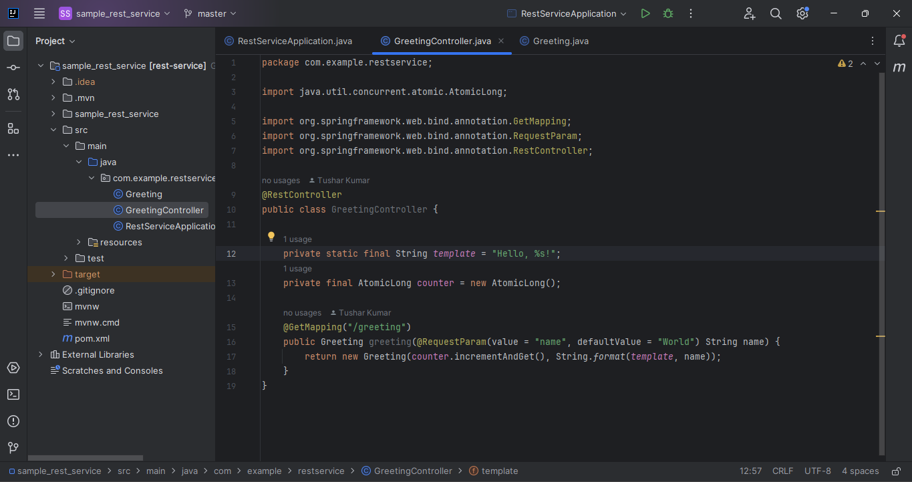

# Spring Boot Service Documentation

## 1. Setting Up IntelliJ IDE 
To begin working with the Spring Boot service, you'll need IntelliJ IDE. If you haven't already, download and install it.

## 2. Cloning the Repository
Clone the project repository from [here](https://github.com/tk1994/sample_rest_service).

### Steps to Clone:
1. Copy the HTTPS URL for cloning the repository.
2. Open IntelliJ IDE and navigate to `Get From VCS`.
3. Paste the HTTPS URL in the designated field and click `Clone`.
4. The project will be cloned successfully.

## 3. Running the Spring Boot Service
Follow these steps to run the Spring Boot service:

* Navigate to `src/main/java/RestServiceApplication`.

* Locate the `RestServiceApplication` file.
* Run this file.
* Check the service on the following URL in your browser: [http://localhost:8080/greeting](http://localhost:8080/greeting).

## 4. Using Postman
Install Postman to interact with the API endpoints exposed by the REST service.

### API Model: Request and Response
Controllers in Spring Boot applications handle incoming HTTP requests and determine the appropriate response to send back.

Controllers act as the entry point for requests to your application. They receive requests, process the necessary data, and determine the appropriate response. This can include returning HTML pages, JSON data for APIs, or redirecting to other URLs.

### Controller Class in the Application

The example application contains a controller named `CreatingController`.

**Explanation of Annotations:**

- `@RestController`: This annotation is used at the class level to indicate that the entire class defines RESTful web service endpoints.

- `@GetMapping("/greeting")`: This annotation maps HTTP GET requests onto specific handler methods in Spring MVC. In this case, it specifies that the method should be invoked when a GET request is sent to the `/greeting` endpoint.

The `greeting` method is designed to handle GET requests to the `/greeting` endpoint. Callers can provide a `name` parameter to customize the greeting message. If no `name` parameter is provided, it defaults to "World". The method returns a `Greeting` object containing a unique ID and a formatted greeting message.
